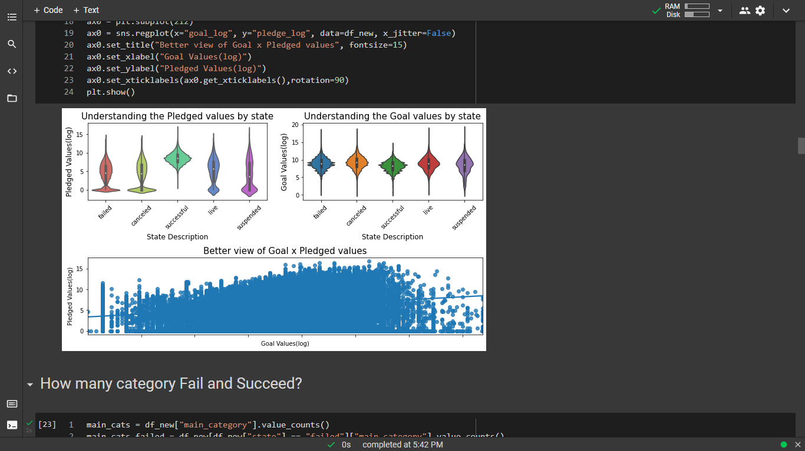
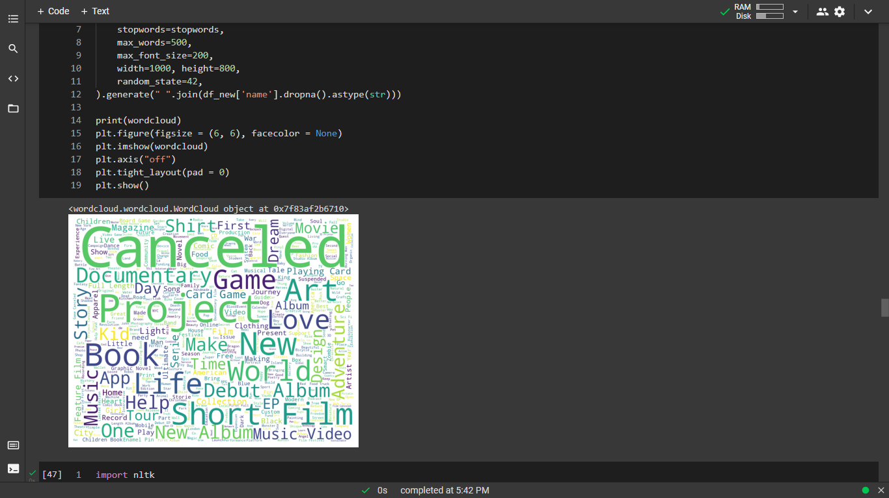

We predict whether a Kickstarter project proposal succeeds or fails to meet the fund-raising objective by only providing information from the project launch by means of 220, 000 project proposals scraped from Kickstarter. We evaluate the performance for these predictions of different machine learning models based on the project category, the fundraising objective and short product descriptions.

## Sample Data: Download from [**here**](https://webrobots.io/kickstarter-datasets/).


## EDA: Some snaps from the notebook







## Modelling

The Baseline Model we selected is Logistic Regression, so in that model we achieved Precision_score:- 0.9853, Recall_score:- 0.966, f1_Score:- 0.9759 and AUC Score:- 0.9828. We also plot fpr vs tpr and in that Train AUC:- 0.9792 and Test AUC:- 0.9796 and we also check Confusion Matrix for train and test both. The Two Performance Model are selected are Decision Tree and Gradient Boosting Decision Tree —

- Decision Tree with Hyperparameter tuning(GridSearchCv):
    1. Using Decision Tree with GridSearchCv we found Best Parameters which are Max_depth = 10 and Max_Sample_split = 100.
    2. Then we plot heatmap with best parameter using groupby of max_depth and max_sample_split
    3. By using this parameter we found root_mean_square_error:- 0.07 and accuracy_score:- 0.9779
    4. We plot fpr vs tpr and in that Train AUC:- 0.998 and Test AUC:- 0.997 and we also check Confusion Matrix for train and test both.
- Gradient Boosting with Hyperparameter tuning(GridSearchCv):
    1. Using GBDT with GridSearchCv we found Best Parameters which are learning_rate = 1 and Max_depth= 3.
    2. Then we plot heatmap with best parameter using groupby of max_depth and learning_rate
    3. By using this parameter we found root_mean_square_error:- 0.07 and accuracy_score:- 0.9771
    4. We plot fpr vs tpr and in that Train AUC:- 0.998 and Test AUC:- 0.998 and we also check Confusion Matrix for train and test both.

## Tools Used

```
Python
Jupyter Notebook
Google Colab
Streamlit
Flask
GitHub
GitBash
```

## Libraries Used

```python
pandas
numpy
sklearn
matplotlib
seaborn
streamlit
nltk
```

## Hosted on Streamlit: Check **[here](https://share.streamlit.io/designer7876/kickstarter-success-prediction/main/app.py)**.

**Procfile:**

```
web: sh setup.sh && streamlit run app.py
```

**setup.sh**

```bash
mkdir -p ~/.streamlit/
echo "\
[server]\n\
headless = true\n\
port = $PORT\n\
enableCORS = false\n\
\n\
" > ~/.streamlit/config.toml
```

https://user-images.githubusercontent.com/56395895/131156078-aa227f90-8e13-4598-9c89-2e6e37b9804e.mp4

## Team Members
- [**Prit Mervana**](https://github.com/Prit005)
- [**Aditya Iyengar**](https://github.com/Designer7876)
- [**Aditya Kamat**](https://github.com/Webdesigner2710)
- [**Suvra Shaw**](https://github.com/suvrashaw)
